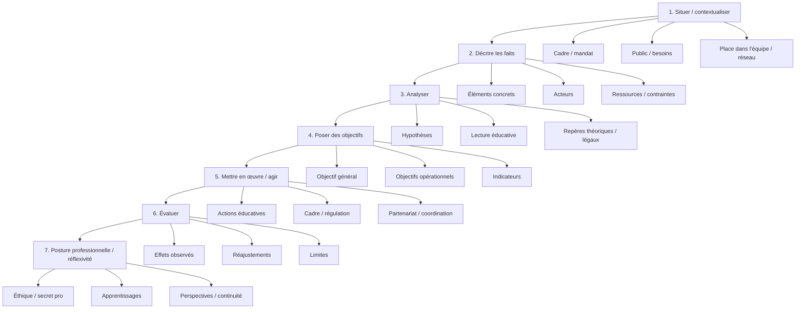

# Architecture d'une réponse complète

---

## Version structurée (texte)

- **1. Situer / contextualiser**
  - Cadre (institution, dispositif, mandat)
  - Public concerné / besoins repérés
  - Rôle et place dans l’équipe / réseau
- **2. Décrire les faits**
  - Situation observée (éléments concrets, datés)
  - Acteurs impliqués
  - Ressources / contraintes
- **3. Analyser**
  - Hypothèses (causes, facteurs)
  - Lecture éducative (besoins, capacités, risques)
  - Repères théoriques / légaux mobilisés
- **4. Poser des objectifs**
  - Objectif général
  - Objectifs opérationnels (priorités)
  - Indicateurs de réussite
- **5. Mettre en œuvre / agir**
  - Actions éducatives (individuel / collectif)
  - Cadre sécurisant, régulation
  - Partenariats / coordination
- **6. Évaluer**
  - Effets observés
  - Ajustements réalisés
  - Limites / points de vigilance
- **7. Posture professionnelle (réflexivité)**
  - Positionnement, éthique, secret professionnel
  - Ce que j’ai appris / ce que je ferais autrement
  - Continuité du parcours / perspectives

---

## Version organigramme (Mermaid)

